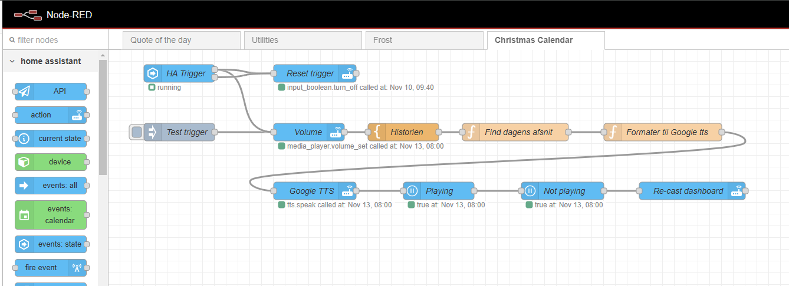
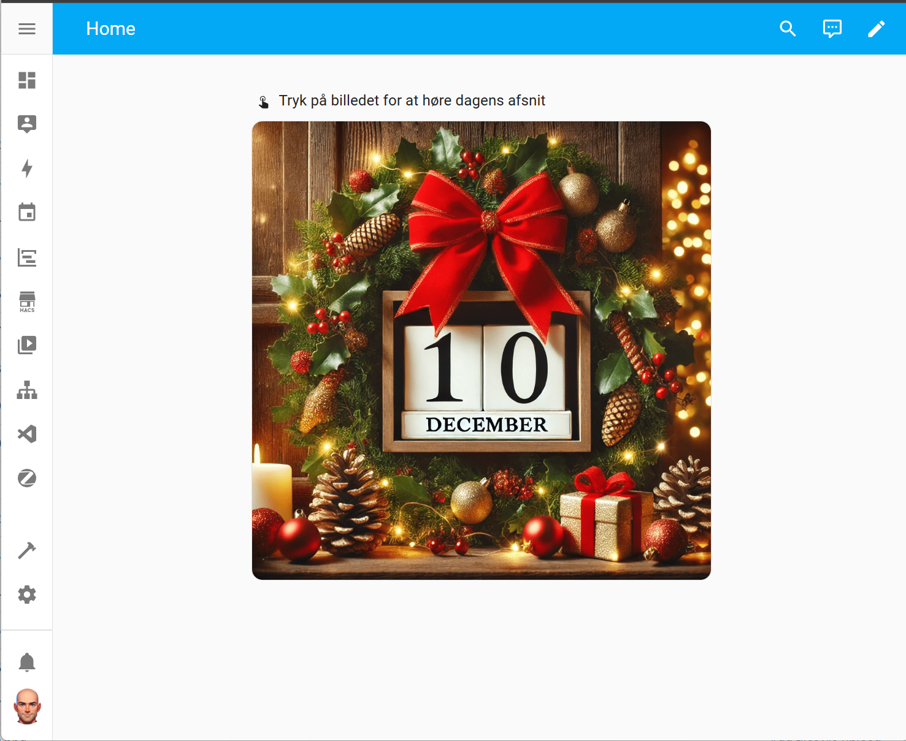
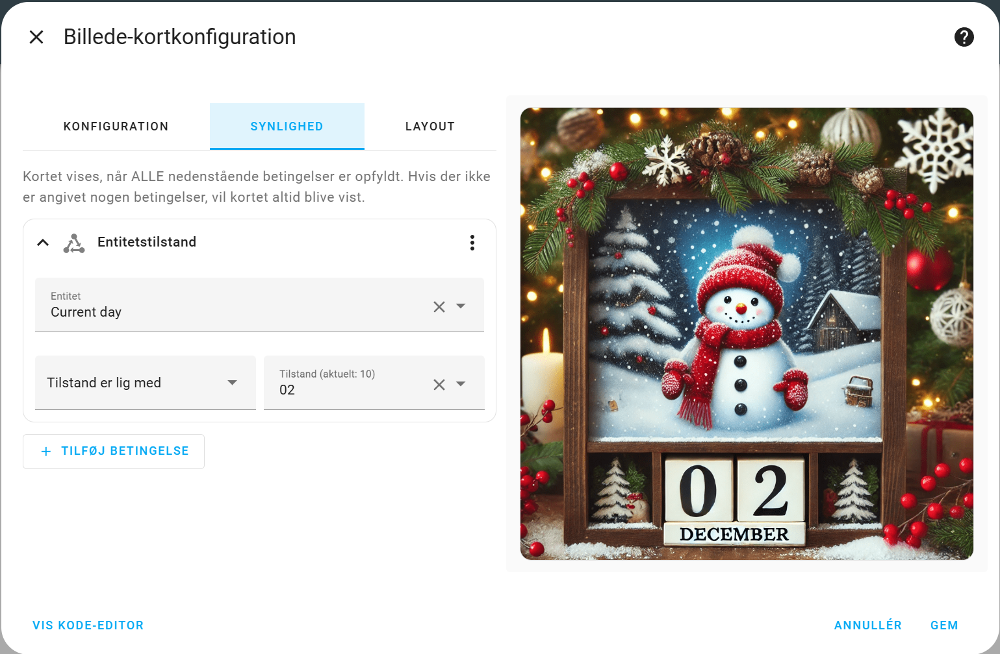
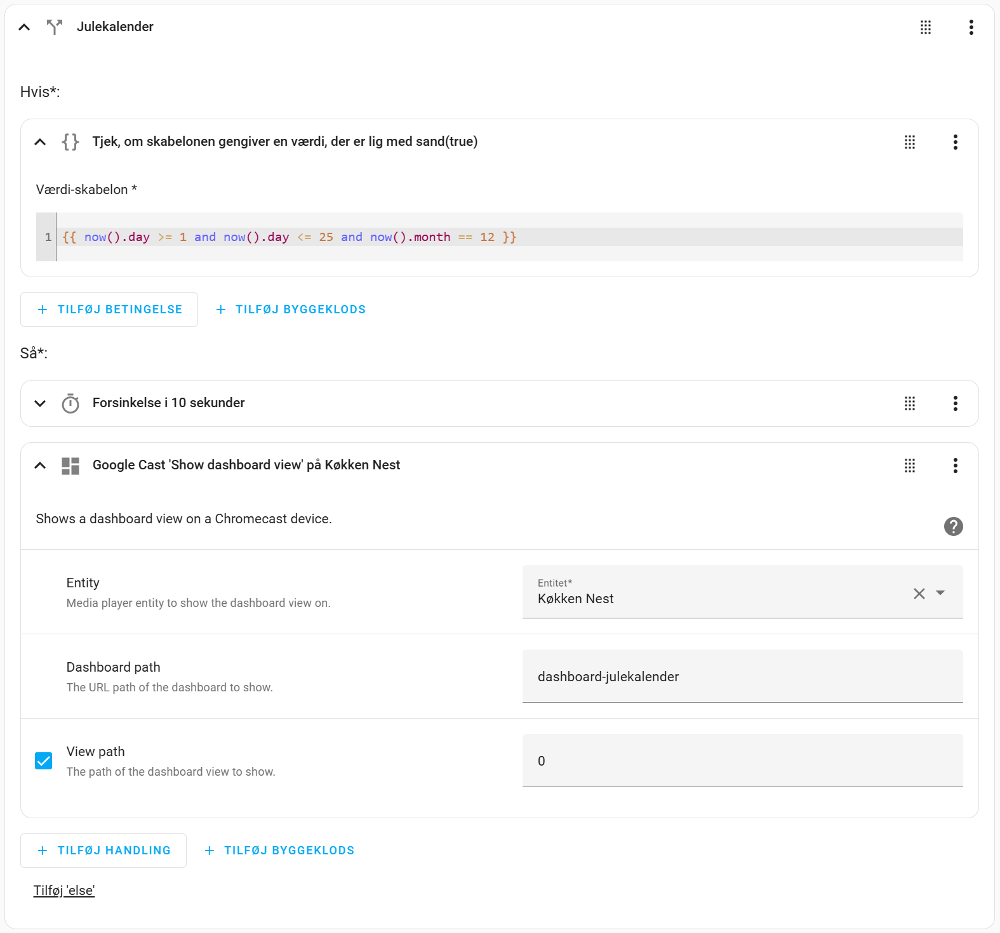

# Home Assistant Julekalender 2024
Min julekalender for mine børn i julen 2024.

## Projektet
- Brug Google text-to-speech til at fortælle en lille jule historie hverdag i højttaler i køkkenet under morgenmad.

- Brug ChatGPT til at lave historien for mig.

- Brug Google Nest Hub til dashboard of højttaler.

- Node-RED er brugt til at lave selve automationen, og bruger også actions fra HA


## Fremgangsmåde
### Selve historien
1. Jeg bad ChatGPT lave en jule kalender i 25 afsnit. Den skulle være på 8-10 sætninger, og have positive, motiverende, opmuntrende og næstekærlige budskaber, som skulle bringes frem af fortælleren. Den skulle tilpasses børn i alderen 8-12 år.
2. Da jeg var tilfreds med historien, bad jeg ChatGPT formater historing i et JSON objekt, med dato fra 01-12-2024 og afsnittet i et array.
3. Jeg bad den indsætte 3 punktummer (...) ved hvert punktum. Dette skal bruge til at give ekstra pause til Google Text-to-speech.

**Eksempel:**
```json
{
  "julekalender": [
    {
      "dato": "14-12-2024",
      "afsnit": "På en kold aften tog Emma og Lukas varm kakao med til en mand, der sad alene på en bænk i parken... Han så overrasket ud, men tog imod med et smil og et taknemmeligt blik... De satte sig ved siden af ham og snakkede lidt om julen og vinterens magi... Hans øjne lyste op, og de mærkede, hvor meget det betød for ham... Nogle gange er det mindste det største for en anden, tænkte de, og de gik hjem med en særlig varme indeni..."
    },
    {
      "dato": "15-12-2024",
      "afsnit": "I dag kom deres venner over for at bygge et julelandskab med små figurer og huse... Sammen lagde de bomuldssne, små træer og lys og skabte et lille vinterlandskab... De arbejdede sammen, grinede og gav hinanden idéer, og da de var færdige, var de alle stolte over det, de havde skabt... Emma og Lukas så på deres vennegruppe og mærkede, hvor særligt det er at skabe noget sammen... Når vi deler vores idéer og kreativitet, bliver det, vi laver, noget helt særligt..."
    },
    {
      "dato": "16-12-2024",
      "afsnit": "Emma og Lukas fandt nogle gamle julehistorier i bedstemors gemmer og begyndte at læse dem op for hinanden... Hver historie mindede dem om, hvordan julen handler om kærlighed og at være sammen... De læste med store øjne og drømte sig tilbage til dengang, deres bedstemor var barn... Bedstemoren smilede og sagde, at historier lever videre, når vi deler dem med hinanden... Emma og Lukas følte, at de var en del af noget større, og de vidste, at de ville huske disse øjeblikke for altid..."
    }
  ]
}
```

3. For at give et lille sjovt element med har jeg bedt den om at tilføje en farjoke til hver dag. Den var ikke super god til at finde på farjokes, da den oversætter engelske til dansk og det giver ikke mening. Jeg har selv indsat/erstattet de dårligste.

**Eksempel:**
```json
{
  "julekalender": [
    {
      "dato": "15-12-2024",
      "afsnit": "I dag kom deres venner over for at bygge et julelandskab med små figurer og huse... Sammen lagde de bomuldssne, små træer og lys og skabte et lille vinterlandskab... De arbejdede sammen, grinede og gav hinanden idéer, og da de var færdige, var de alle stolte over det, de havde skabt... Emma og Lukas så på deres vennegruppe og mærkede, hvor særligt det er at skabe noget sammen... Når vi deler vores idéer og kreativitet, bliver det, vi laver, noget helt særligt...",
      "farjoke": "Hvordan sætter man en frakke på en kage? Man giver den et lag glasur..."
    },
    {
      "dato": "16-12-2024",
      "afsnit": "Emma og Lukas fandt nogle gamle julehistorier i bedstemors gemmer og begyndte at læse dem op for hinanden... Hver historie mindede dem om, hvordan julen handler om kærlighed og at være sammen... De læste med store øjne og drømte sig tilbage til dengang, deres bedstemor var barn... Bedstemoren smilede og sagde, at historier lever videre, når vi deler dem med hinanden... Emma og Lukas følte, at de var en del af noget større, og de vidste, at de ville huske disse øjeblikke for altid...",
      "farjoke": "Hvad kalder man en sko uden snørebånd? En løs hæl..."
    },
    {
      "dato": "17-12-2024",
      "afsnit": "På vej hjem fra skolen så Emma og Lukas, hvordan nogle fugle kæmpede for at finde mad under sneen... De samlede nogle krummer og nødder og lagde dem forsigtigt ud til fuglene, som hurtigt samlede sig om maden... Fuglene fløj omkring dem og spiste gladeligt, og Emma og Lukas følte sig glade for at kunne hjælpe... Selv en lille gestus kan betyde meget for andre, tænkte de, og de besluttede at fodre fuglene hver dag resten af vinteren...",
      "farjoke": "Hvorfor kan myren ikke låne bilen? Fordi den er alt for lille til rattet!"
    }
  ]
}
```

- [Afsnit i JSON-format](https://github.com/LasseHedeby/ha-christmas-story-2024/blob/main/afsnit.json) :link:

---

### Automation til afsnit med Node-RED
>**TIP**
>
>Jeg har brugt Node-Red da en entitet i HA ikke kan indeholde mere end 255 karakter, så at overføre historien til HA med Node-RED og så lave resten der gav ikke rigtig mening.

4. Jeg har lavet et Node-RED flow til at styre selve julekalenderen.
    - Den finder det `JSON`-entry der passer til dags dato, og formater historien.
    - Derefter bruger jeg Google text-to-speech til at sende til Google Nest Hub som har en `media_player` entitet.
    - Flowet triggers af en `input_boolean` entitet, som bliver styret af et dedikeret dashboard



- [Flow til Node-RED i JSON-format](https://github.com/LasseHedeby/ha-christmas-story-2024/blob/main/Christmas_Calendar_Flow.json) :link:

### Dasboard i Home Assistant
5. Jeg har lavet et dedikeret dashboard som er skjult i sidebjælken, som skal castes til Google Nest Hub.
    - ChatGPT har lavet billeder af en kalenderlåge for hverdag fra 1. til 25. december.
    - På dashboard vises billederne baseret på betingelsen for hvilken dag det er.

- [Billeder til kalenderlåge](https://github.com/LasseHedeby/ha-christmas-story-2024/tree/main/calendar_images) :link:



6. Hver låge er lavet som et `picture` på dashboard.
    - Synlighed er sat til at en `sensor` hjælper som skriver dagens dato med template, og denne bruges så som betingelse

    - På hver låge er Tap-behavior sat til at sætte en `input_boolean` hjælper ON, som bruges i Node-RED.
    - Der er så lave en for hver dag fra 1. til 25.

> **NOTE**
>
> Jeg fandt ikke lige nogen måde at lave dette dynamisk. Template i filnavn til billedet virkede ikke.

### Aktiver når det bliver december
7. Jeg har i forvejen en automation der triggers hver morgen
    - Denne automation tager faktisk en hel del informationer og samler, og så afspiller den det på min Sonos via TTS. Bl.a. dagens vejr, kalender aftaler, dagens citat, osv.
8. I denne automation harjeg i slutningen tilføjet en `Hvis..så`
    - Den har en betingelse at det er 1. til 25. december.
    - Så trigger den action til at caste et dashboard til min Google Nest

